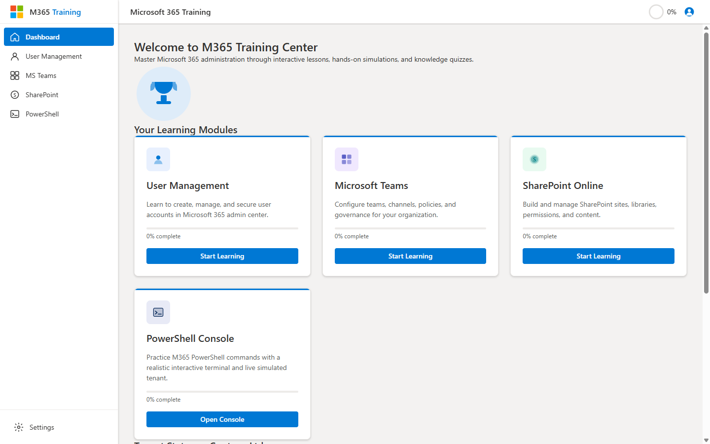

# m365-training

> An interactive, dependency-free web app for learning **Microsoft 365 administration** through lessons, hands-on simulations, knowledge quizzes, and a realistic PowerShell console — all running against a fully simulated tenant.

The M365 Training Center is a single-page application (SPA) written in **vanilla JavaScript, HTML, and CSS — no frameworks, no build step, no backend**. Open `index.html` in a browser and it just works. All progress is saved locally in the browser, and every "Microsoft 365 environment" you interact with is a self-contained, in-memory simulation of a fictional tenant (Contoso Ltd).

It's designed for aspiring M365 admins, IT students, and anyone who wants to practice administrative tasks without touching a production tenant.



---

## Table of Contents

- [Features](#features)
- [Quick Start](#quick-start)
- [Project Structure](#project-structure)
- [How It Works](#how-it-works)
  - [Architecture Overview](#architecture-overview)
  - [The Core Engine (`app.js`)](#the-core-engine-appjs)
  - [The Module System](#the-module-system)
  - [The Simulated Tenant (`sim-tenant.js`)](#the-simulated-tenant-sim-tenantjs)
  - [The PowerShell Console (`sim-console.js`)](#the-powershell-console-sim-consolejs)
  - [State & Persistence](#state--persistence)
  - [Routing](#routing)
- [The Learning Modules](#the-learning-modules)
- [Extending the App: Adding a New Module](#extending-the-app-adding-a-new-module)
- [Data Model Reference](#data-model-reference)
- [Browser Support](#browser-support)
- [Contributing](#contributing)
- [License](#license)

---

## Features

- **Zero dependencies, zero build.** Pure HTML/CSS/JS. No npm, no bundler, no server required.
- **Four learning modules** — User Management, Microsoft Teams, SharePoint Online, and a PowerShell Console — each with lessons, an interactive simulation, and a quiz.
- **Realistic simulated tenant** — 50 generated users, license pools, groups, Teams, SharePoint sites, mailboxes, service health, conditional-access policies, and a live audit log for the fictional *Contoso Ltd*.
- **Interactive PowerShell console** — a fake terminal that understands real M365 cmdlets (`Connect-MsolService`, `Get-MsolUser`, `New-MsolUser`, `Get-Mailbox`, `Search-UnifiedAuditLog`, and more), with command history and tab completion, operating on the simulated tenant.
- **Quiz engine** — multiple-choice quizzes with instant feedback, explanations, scoring, and a 70% passing threshold.
- **Progress tracking** — per-module and overall progress, persisted in `localStorage`, visualized with progress bars and an SVG ring.
- **Sequential lesson locking** — lessons unlock one at a time so learners follow the intended path.
- **Accessible & responsive** — semantic HTML, ARIA roles, keyboard navigation, and a Fluent-inspired UI that adapts to screen size.

---

## Quick Start

No installation, no toolchain.

```bash
# Clone the repository
git clone <repo-url>
cd m365-training
```

Then **open `index.html`** in any modern browser. That's it.

> **Tip:** For the cleanest experience (correct relative paths, history routing), serve the folder over a tiny local HTTP server instead of `file://`:
>
> ```bash
> # Python 3
> python -m http.server 8000
> # then visit http://localhost:8000
> ```
>
> ```bash
> # Node (if you have it)
> npx serve .
> ```

Your progress is stored in the browser's `localStorage` under the key `M365TrainingState`. Clearing site data resets all progress.

---

## Project Structure

```
m365-training/
├── index.html              # App shell: top nav, sidebar, all views, SVG icon defs, script tags
├── css/
│   └── styles.css          # All styling (Fluent-inspired design system)
├── js/
│   ├── app.js              # Core engine: routing, state, module registry, views, quiz engine
│   ├── sim-tenant.js       # Simulated Contoso tenant data + mutation API (window.M365Tenant)
│   ├── sim-console.js      # Interactive PowerShell console + registers the "console" module
│   ├── module-users.js     # User Management module (lessons + simulation + quiz)
│   ├── module-teams.js     # Microsoft Teams module
│   └── module-sharepoint.js# SharePoint Online module
├── LICENSE
├── .gitignore
└── README.md
```

The **shipping app** is `index.html` + `css/styles.css` + the six files in `js/`.

---

## How It Works

### Architecture Overview

The app is a classic **modular SPA** built on three global namespaces, loaded in order by `index.html`:

| Global | Defined in | Responsibility |
|--------|-----------|----------------|
| `window.M365Tenant` | `sim-tenant.js` | The simulated data layer — users, licenses, groups, etc., plus read/mutate helpers. |
| `window.M365App` | `app.js` | The application engine — routing, state, rendering, and the public `registerModule()` API. |
| `window.M365Console` | `sim-console.js` | The PowerShell terminal renderer and command processor. |

Script load order matters and is handled in `index.html`:

```html
<script src="js/sim-tenant.js"></script>   <!-- 1. data first -->
<script src="js/app.js"></script>          <!-- 2. engine + registry -->
<script src="js/module-users.js"></script> <!-- 3. modules self-register -->
<script src="js/module-teams.js"></script>
<script src="js/module-sharepoint.js"></script>
<script src="js/sim-console.js"></script>  <!-- 4. console module -->
```

Each module file is an **IIFE** that calls `window.M365App.registerModule(config)` to plug itself into the engine. The engine doesn't know anything about specific modules ahead of time — it renders whatever is registered. This makes the app trivially extensible: drop in a new `module-*.js`, add a `<script>` tag, and it appears.

```
┌─────────────────────────────────────────────────────────┐
│                       index.html                         │
│   top nav · sidebar · views (dashboard/module/lesson)    │
└───────────────┬─────────────────────────────────────────┘
                │ renders into
        ┌───────▼────────┐         registers modules
        │     app.js     │◄───────────────┬───────────────┐
        │  (M365App)     │                │               │
        │ router · state │         module-users.js   module-teams.js
        │ quiz engine    │         module-sharepoint.js
        │ module registry│         sim-console.js (console module)
        └───────┬────────┘                │
                │ reads / mutates          │ read/mutate
        ┌───────▼────────────────────────▼───────┐
        │            sim-tenant.js                │
        │  (M365Tenant: users, licenses, groups…) │
        └─────────────────────────────────────────┘
```

### The Core Engine (`app.js`)

`app.js` is the heart of the application. It is a single IIFE that exposes `window.M365App` and is organized into clearly numbered sections:

- **Default state factory & state management** — builds the initial progress object and loads/merges any saved state from `localStorage`.
- **Module registry** — `registerModule(config)` stores each module by `id`, ensures a state bucket exists for it, and re-renders affected views.
- **Router** — hash-based routing (`#dashboard`, `#module/users`, `#lesson/users/creating-users`) that keeps the URL, state, and visible view in sync.
- **View switching** — shows exactly one `.view` section at a time (Dashboard, Module, Lesson, Settings) with a fade animation.
- **Dashboard rendering** — module cards, progress bars, overall stats, and the SVG progress ring.
- **Progress calculations** — a module's progress = `(completed lessons + quiz-passed? + sim-done?) / (total lessons + has-quiz? + has-sim?)`. Overall progress is the average across registered modules.
- **Module view** — renders the shared module page with three tabs: **Lessons**, **Simulation**, **Quiz**.
- **Lesson view** — renders a single lesson's HTML content and a "Mark as complete" action that unlocks the next lesson.
- **Quiz engine** — drives multiple-choice questions, scores them, auto-advances after a short delay, and records the result (pass = ≥ 70%).
- **Toasts & modals** — lightweight notification and dialog helpers.
- **Public API** — the `M365App` object (see below).

**Public API (`window.M365App`):**

```js
M365App.registerModule(config)   // register a learning module
M365App.navigate(view, params)   // programmatic navigation
M365App.toast(message, type)     // 'success' | 'error' | 'info'
M365App.showModal(...)           // show a modal dialog
M365App.getModuleProgress(id)    // 0–100 for a module
M365App.getOverallProgress()     // 0–100 across all modules
M365App.getState()               // current persisted state object
M365App.saveState()              // force-persist state
M365App.updateProgress()         // recompute rings/stats/dashboard
```

### The Module System

A **module** is a plain object describing a topic. Modules self-register at load time. The minimal shape:

```js
window.M365App.registerModule({
  id: 'users',                         // unique id, used in routing & state
  title: 'User Management',
  subtitle: 'Learn to manage M365 users, licenses, and identities',
  color: '#0078d4',
  icon: 'person',
  lessons: [ /* lesson objects */ ],   // ordered; unlocked sequentially
  simulation: { /* simulation object */ },
  quiz: [ /* question objects */ ]
});
```

The engine reads these fields to render the dashboard card, the module tabs, the lesson list, and to compute progress. Any of `lessons`, `simulation`, or `quiz` may be omitted; progress math adapts automatically.

**Lesson object:**

```js
{
  id: 'creating-users',          // unique within the module
  title: 'Creating New User Accounts',
  duration: '10 min read',
  difficulty: 'Beginner',        // shown as metadata
  content: '<h2>…</h2>'          // raw HTML rendered into the lesson view
}
```

Lessons are **locked sequentially** — a lesson stays locked until every lesson before it is marked complete. Completing a lesson appends its `id` to `state.modules[moduleId].completedLessons`.

**Simulation object:**

```js
{
  title: 'M365 PowerShell Console',
  description: 'Practice real M365 PowerShell commands in an interactive terminal.',
  tasks: [
    { instruction: 'List all users with Get-MsolUser', points: 15 },
    // …
  ],
  render: function (container, helpers) {
    // Build any custom interactive UI inside `container`.
    // helpers.completeTask(taskId) → toast feedback
    // helpers.completeSim()        → marks the simulation complete & updates progress
  }
}
```

The engine renders the task list, then calls your `render()` with a DOM container and a `helpers` object. Simulations range from a clickable admin-center mock (User Management) to the full PowerShell terminal (Console module).

**Quiz question object:**

```js
{
  id: 'users-q1',
  question: 'When offboarding a user, what should you do FIRST?',
  options: ['Delete their account', 'Block their sign-in', 'Remove their licenses', 'Transfer their files'],
  correct: 1,                    // index into options
  explanation: 'Blocking sign-in immediately prevents access while you finish offboarding.'
}
```

The quiz engine shows one question at a time, highlights correct/incorrect on selection, displays the `explanation`, auto-advances, and at the end records the percentage score. A score of **70% or higher** counts the quiz as passed for progress purposes.

### The Simulated Tenant (`sim-tenant.js`)

This file fabricates a believable Microsoft 365 tenant so simulations have real-looking data to act on. It exposes `window.M365Tenant`:

- **`tenant`** — name (*Contoso Ltd*), domains, tenant ID, region, admin URL.
- **`licenses`** — six SKU pools (Business Premium/Standard/Basic, EMS E3, Exchange Online, Teams Exploratory) with totals, assigned counts, prices, and bundled services.
- **`users`** — ~50 procedurally generated UK users with names, UPNs, departments, job titles, offices, licenses, and status.
- **`groups`, `teams`, `sharePointSites`, `sharedMailboxes`** — collaboration objects.
- **`serviceHealth`** — per-service status (Operational / Service Degradation / Advisory), surfaced on the dashboard.
- **`auditLog`, `conditionalAccess`** — security/compliance data.

**Mutation API** (used by simulations and the console):

```js
M365Tenant.addUser(user)            // assigns an id and appends
M365Tenant.removeUser(email)        // returns true/false
M365Tenant.findUser(query)          // fuzzy search by email/displayName/upn
M365Tenant.getUser(emailOrUpn)      // exact lookup
M365Tenant.addAuditEntry(entry)     // timestamps & prepends; caps log at 50
```

The dashboard's **Tenant Status** and **Service Health** panels (wired up by the inline script at the bottom of `index.html`) read directly from this object and refresh whenever the dashboard becomes visible (via a `MutationObserver`).

### The PowerShell Console (`sim-console.js`)

The Console module turns the Simulation tab into an interactive fake terminal. It:

1. Renders a terminal UI (prompt, output area, blinking cursor) into the simulation container.
2. Parses typed commands and dispatches to handlers for real M365 cmdlets, operating on `M365Tenant`.
3. Maintains **command history** (↑/↓) and **tab completion** for known cmdlets.
4. Writes successful state-changing commands to the tenant's **audit log**.

Supported cmdlets include connection commands (`Connect-MsolService`, `Connect-ExchangeOnline`, `Connect-MicrosoftTeams`, `Connect-SPOService`), user management (`Get-MsolUser`, `New-MsolUser`, `Set-MsolUser`, `Set-MsolUserPassword`, `Set-MsolUserLicense`, `Remove-MsolUser`), licensing (`Get-MsolAccountSku`), groups (`Get-MsolGroup`), Exchange (`Get-Mailbox`, `Get-MailboxStatistics`), security/compliance (`Search-UnifiedAuditLog`, `Get-ServiceHealth`), and pipeline-style helpers like `Get-MsolUser | Measure-Object`. Type `help` (or `Get-Help`) in the console for the full list.

It exposes `window.M365Console` (`renderConsole`, `processCommand`, `getHistory`) and registers itself as the **`console`** module with its own intro lesson, a 7-task simulation, and a 5-question quiz.

### State & Persistence

State is a single JSON object persisted to `localStorage` under `M365TrainingState`:

```js
{
  modules: {
    users:      { completedLessons: [], quizScore: null, simCompleted: false },
    teams:      { completedLessons: [], quizScore: null, simCompleted: false },
    sharepoint: { completedLessons: [], quizScore: null, simCompleted: false }
    // console bucket is created on registration
  },
  currentModule: null,
  currentLesson: null,
  currentTab: 'lessons'
}
```

On load, the saved state is **merged with the default** so newly added modules/keys always exist (forward-compatible upgrades). Saving is best-effort and wrapped in try/catch so a full or disabled `localStorage` never breaks the UI.

> Note: the **tenant data** in `sim-tenant.js` is *not* persisted — it's re-created in memory on every page load. So console/simulation changes (new users, blocked accounts) reset on refresh, while *learning progress* persists.

### Routing

Hash-based routing keeps deep links shareable and the back button working:

| URL hash | View |
|----------|------|
| `#dashboard` (or empty) | Dashboard |
| `#module/<moduleId>` | Module page (lessons/sim/quiz tabs) |
| `#lesson/<moduleId>/<lessonId>` | Single lesson |
| `#settings` | Settings |

`navigate()` updates state, pushes the new hash, and shows the matching view; `parseHash()` does the reverse on load and on `popstate`.

---

## The Learning Modules

| Module | Lessons | Simulation | Quiz |
|--------|:------:|-----------|:----:|
| **User Management** (`users`) | 6 | Clickable Admin-Center-style user panel (edit, reset password, block/unblock, delete) | 10 questions |
| **Microsoft Teams** (`teams`) | 6 | Teams governance/configuration simulation | 10 questions |
| **SharePoint Online** (`sharepoint`) | 6 | SharePoint site/library/permissions simulation | quiz included |
| **PowerShell Console** (`console`) | 1 intro | Full interactive PowerShell terminal (7 graded tasks) | 5 questions |

Topics span the M365 admin essentials: the Admin Center and RBAC roles, creating/licensing/offboarding users, M365 Groups, Teams policies and governance, SharePoint sites and permissions, and PowerShell automation.

---

## Extending the App: Adding a New Module

Adding a module takes three small steps and **no changes to the engine**.

**1. Create `js/module-exchange.js`** following the registration pattern:

```js
(function () {
  'use strict';
  window.M365App = window.M365App || {};
  window.M365App.registerModule = window.M365App.registerModule || function () {};

  var lessons = [
    {
      id: 'exo-overview',
      title: 'Exchange Online Overview',
      duration: '5 min read',
      difficulty: 'Beginner',
      content: '<h2>Exchange Online</h2><p>…</p>'
    }
    // …more lessons (rendered in order, unlocked sequentially)
  ];

  var simulation = {
    title: 'Mailbox Management',
    description: 'Practice managing mailboxes.',
    tasks: [ { instruction: 'Create a shared mailbox', points: 20 } ],
    render: function (container, helpers) {
      // build interactive UI; call helpers.completeSim() when done
    }
  };

  var quiz = [
    {
      id: 'exo-q1',
      question: 'Which cmdlet lists mailboxes?',
      options: ['Get-Mailbox', 'Get-User', 'Get-Recipient', 'Get-MailUser'],
      correct: 0,
      explanation: 'Get-Mailbox returns all mailboxes in the organization.'
    }
  ];

  window.M365App.registerModule({
    id: 'exchange',
    title: 'Exchange Online',
    subtitle: 'Manage mailboxes, mail flow, and protection',
    color: '#0078d4',
    icon: 'mail',
    lessons: lessons,
    simulation: simulation,
    quiz: quiz
  });
})();
```

**2. Add a sidebar link and a dashboard card** in `index.html` (copy an existing `data-module="…"` entry and change the id/labels).

**3. Add the script tag** in `index.html`, *after* `app.js`:

```html
<script src="js/module-exchange.js"></script>
```

Reload — the new module appears on the dashboard, gets its own state bucket, and contributes to overall progress automatically. Use `window.M365Tenant` inside your simulation to read or mutate the fake tenant.

---

## Data Model Reference

**Module config**

| Field | Type | Notes |
|-------|------|-------|
| `id` | string | Unique; used in routing/state. **Required.** |
| `title` | string | Display name. |
| `subtitle` | string | Short description. |
| `color` | string | Accent color (hex). |
| `icon` | string | Icon key. |
| `lessons` | array | Ordered lesson objects. |
| `simulation` | object | `{ title, description, tasks[], render(container, helpers) }`. |
| `quiz` | array | Question objects. |

**Lesson:** `{ id, title, duration, difficulty, content (HTML) }`
**Simulation task:** `{ instruction, points }`
**Quiz question:** `{ id, question, options[], correct (index), explanation }`

**Progress formula (per module):**

```
parts        = lessons.length + (hasQuiz ? 1 : 0) + (hasSim ? 1 : 0)
completed    = completedLessons.length
             + (quizScore >= 70 ? 1 : 0)
             + (simCompleted ? 1 : 0)
modulePct    = parts === 0 ? 0 : (completed / parts) * 100
overallPct   = average(modulePct for every registered module)
```

---

## Browser Support

Any modern evergreen browser (Chrome, Edge, Firefox, Safari). The app uses ES5-style vanilla JS, standard DOM APIs, `localStorage`, SVG, and `MutationObserver` — no transpilation needed. No Internet Explorer support is targeted.

---

## Contributing

Contributions are welcome — new modules, additional lessons/quiz questions, more console cmdlets, simulation polish, accessibility improvements, and bug fixes.

Suggested workflow:

1. Fork and create a feature branch.
2. Make your change against the vanilla-JS app (`index.html`, `css/styles.css`, `js/*.js`).
3. Test by opening the app in a browser — verify the dashboard, your module's lessons/sim/quiz, and progress tracking all work.
4. Keep the **no-build, no-dependency** philosophy: plain HTML/CSS/JS only.
5. Open a pull request describing the change.

When adding M365 content, aim for **technical accuracy** — these lessons teach real administrative practices.

---

## License

Released under the [MIT License](LICENSE).

*Microsoft, Microsoft 365, Teams, SharePoint, Exchange, and PowerShell are trademarks of Microsoft Corporation. This project is an independent, unofficial training tool and is not affiliated with or endorsed by Microsoft. All tenant data is fictional.*
